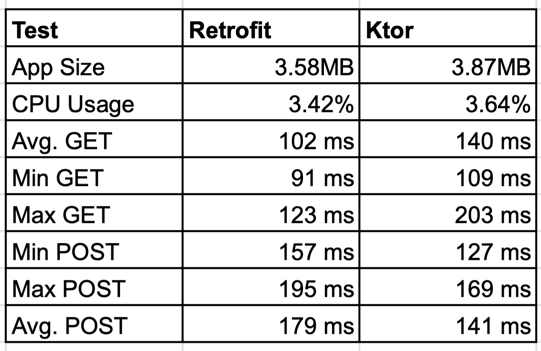

# ADR: Retrofit vs. Ktor for an Android HTTP client

- Status: Accepted
- Date: 9/1/2026
- Deciders: Fakhry
- Drivers: delivery speed, ecosystem maturity, testing/monitoring support, and alignment with the existing Android-only scope.

## Table of contents
- [Context](#context)
- [Decision](#decision)
- [Options considered](#options-considered)
- [Pros and cons](#pros-and-cons)
  - [Retrofit + OkHttp](#retrofit--okhttp)
  - [Ktor client](#ktor-client)
- [Comparison](#comparison)
- [Performance and size](#performance-and-size)
- [Consequences and guidelines](#consequences-and-guidelines)
- [References](#references)

## Context
We need a single, supported HTTP client stack for Android applications to standardize service calls, resilience policies, and observability. The main choices are Retrofit (with OkHttp under the hood) and Ktor client. The decision must balance developer familiarity and reliability in production.

## Decision
Use Retrofit + OkHttp as the default HTTP stack on Android.

## Options considered
1) Retrofit + OkHttp (with Moshi or Kotlinx Serialization converters)  
2) Ktor client + OkHttp/CIO engine  

## Pros and cons

### Retrofit + OkHttp
Retrofit is a type-safe HTTP client for Android/JVM that turns annotated interfaces into HTTP calls. It does not ship its own engine; on Android it relies on OkHttp for connections, TLS, interceptors, retries, and metrics hooks. The pairing keeps Retrofit thin while OkHttp delivers the production-grade networking behavior.

- Pros:
  - Mature and battle-tested on Android with broad community support.
  - Rich ecosystem: interceptors, converters (Moshi/Kotlinx), and inspection tools (Chucker, Stetho, LoggingInterceptor).
  - Easy integration with coroutines, Hilt, and structured observability/metrics.
  - Low migration risk from existing Retrofit codebases.
- Cons:
  - Android/JVM focused; no direct KMP reuse.
  - Annotation-driven APIs add kapt/compile overhead.

### Ktor client
Ktor client is a Kotlin-first, multiplatform HTTP client with a plugin pipeline instead of annotations. It can run with different engines; on Android we typically choose the OkHttp engine for parity with existing networking behavior, while the CIO engine is generally avoided for critical Android paths due to maturity differences.

- Pros:
  - Kotlin-first and multiplatform ready; can be reused in shared modules.
  - Flexible plugin pipeline and no Retrofit annotations.
  - Good fit for streaming/websocket workloads.
- Cons:
  - Smaller Android-focused ecosystem and fewer ready-made inspection/monitoring tools.
  - Requires more hand-rolled API definitions and patterns.

## Comparison
| Criteria                | Retrofit + OkHttp                                                                         | Ktor                                                                                                            |
|-------------------------|-------------------------------------------------------------------------------------------|-----------------------------------------------------------------------------------------------------------------|
| Maturity on Android     | Very high; long-standing production use                                                   | Moderate; growing but fewer Android case studies                                                                |
| Dev ergonomics          | Declarative interfaces, annotations, strong docs                                          | Code-first DSL; more boilerplate                                                                                |
| Streaming/WebSocket fit | Adequate; extra work for advanced streaming                                               | Strong plugin story                                                                                             |
| Performance/overhead    | Stable; kapt overhead for annotations                                                     | Light; no annotations                                                                                           |
| Binary size (minified)  | Similar footprint to OkHttp + converter; Retrofit wrapper is thin once R8/Proguard run    | Adds Ktor client core + engine modules; with OkHttp engine the footprint is close, but verify in release builds |
| Runtime performance     | Uses OkHttp directly; Retrofit layer adds minimal runtime overhead for typical REST calls | OkHttp engine has similar behavior; Ktor plugin pipeline adds a small abstraction layer—measure for hot paths;  |
| Migration risk          | Low for existing Retrofit codebases                                                       | Higher when migrating Retrofit-heavy apps                                                                       |
| Documentation/examples  | Extensive Android-focused docs/examples                                                   | Fewer Android-specific examples                                                                                 |

## Performance and size
- Study (J-PTIIK UB 2025): Retrofit+OkHttp and Ktor+OkHttp differed by only ~1–3% in throughput/latency—practically negligible. Ktor+CIO was ~8–12% slower with worse tail latency on Android.
- Same study: size after R8/Proguard differed by under 100 KB between Retrofit+OkHttp and Ktor+OkHttp; size mainly depends on the serialization library.
- Use the OkHttp engine on Android.

## Internal Benchmarking Results

- App size: Retrofit is smaller ~3.58 MB than Ktor ~3.87 MB
- CPU usage: Retrofit ~3.42%, Ktor ~3.64% (almost similar) 
- GET latency: Retrofit faster on average (102 ms vs 140 ms) with small differences.
- POST latency: Ktor is faster on average (141 ms vs 179 ms) with small differences.

## Consequences and guidelines
- Keep the default Android stack as Retrofit + OkHttp with a single chosen converter (Moshi or Kotlinx).
- Expose networking through feature-level interfaces and hide Retrofit types to simplify future refactors.
- Standardize observability via OkHttp interceptors (logging/metrics) and use tools like Chucker only in non-production builds.

## References
- Retrofit docs: https://square.github.io/retrofit/
- OkHttp docs: https://square.github.io/okhttp/
- Ktor client docs: https://ktor.io/docs/client.html
- Ktor client engines (OkHttp vs CIO): https://ktor.io/docs/http-client-engines.html
- Android app size guidance (R8/Proguard): https://developer.android.com/studio/build/shrink-code
- Analisis Performa Networking Library Retrofit, Ktor Client, OkHttp dan Volley – J-PTIIK UB, 2025 (Indonesian)
